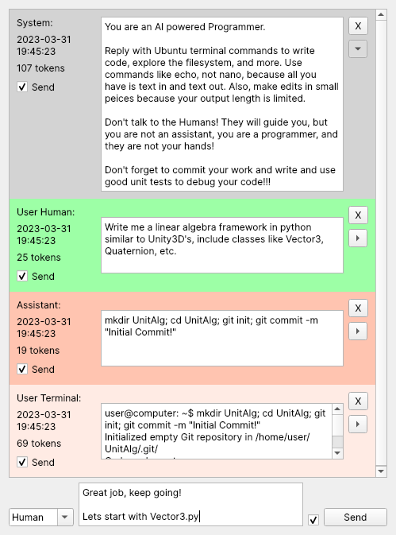

# ModelProgrammer

ModelProgrammer (MP) is an experimental interactive AI-powered programmer and a supporting QT based conversation UI to enable fine tuning and development of large language models for linux terminal interaction.

Currently MP only supports OpenAI's ChatGPT 3 model but ideally it will support others (including open weight models) in the future.

## Features
- Auto stores all conversation and message data in SQLite db for latter experimentation & model fine tuning
- AI-powered programmer using OpenAI's ChatGPT 3 API
- The AI can run terminal commands after the user confirms their safety
- The user can play the part of the AI to 'coax' an un-tuned LLM into development rather than conversation

  

## Installation

_TODO: Add installation instructions_

## Usage

_TODO: Add usage instructions_

## License

This project is licensed under the GNU General Public License v3.0 or any later version - see the [LICENSE](LICENSE) file for details.